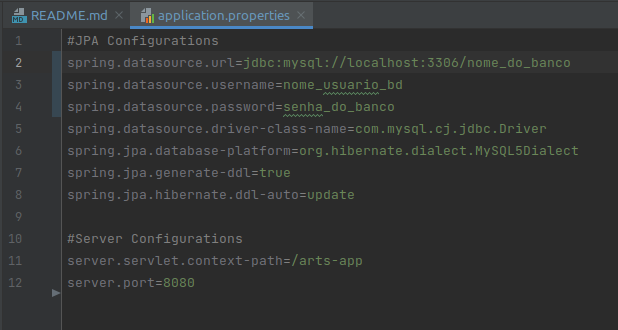
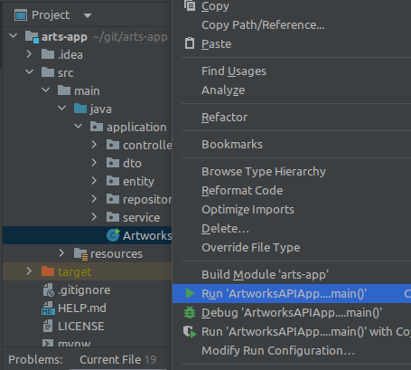
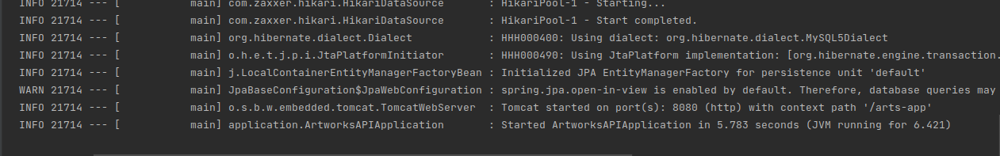
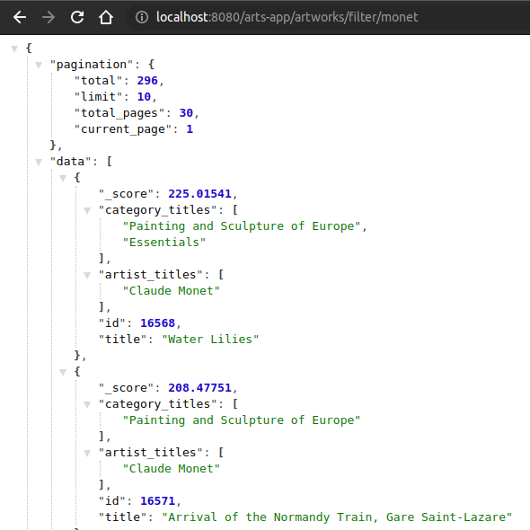

# Backend Artworks API

Esta é uma API REST com objetivo de consumir os dados da API externa  **[Art Institute of Chicago API](https://api.artic.edu/docs/#introduction)**, 
retornando alguns dados em JSON.

### Tecnologias Utilizadas

- Java
- Spring Boot
- Maven
- MySQL

### Pré-requisitos

- IDE: [Intellij IDEA](https://www.jetbrains.com/pt-br/idea/download/), [Eclipse](https://www.eclipse.org/downloads/) ou [Netbeans](https://netbeans.apache.org/download/). Nos exemplos abaixo foi utilizado o Intellij (também recomendo como IDE para rodar o projeto, tendo em vista que as dependecias do Maven já serão indexadas assim que o projeto for aberto).
- [Java JDK 11](https://www.oracle.com/br/java/technologies/javase/jdk11-archive-downloads.html) ou posterior.
- [MySQL 8](https://dev.mysql.com/downloads/).

###  Quick Start

1. Clone o projeto do repositório: `git clone https://github.com/barcelosguitar/arts-app`.
2. No MySQL, crie o banco de dados "artwork_api": `create database artworks_api`.
3. Abra sua IDE e antes de tudo, abra o arquivo application.properties que está dentro da pasta resources e altere as informações do nome do banco (caso tenha utilizado um nome de banco diferente), o nome de usuário e a senha do banco. Por padrão do MySQL, usuário "root" e senha "root", caso não tenha cadastrado outra senha no momento da configuração do banco.
 

     
 

4. Rode o projeto na classe principal **ArtworksAPIApplication.java**:

    

5. Caso tudo o ocorra bem, o Spring retornará o log com este final:

   

6. Abra seu navegador ou o Postman (caso o tenho instalado, utilize o método GET) e digite ou cole o endereço: 
`localhost:8080/arts-app/artworks/filter/monet` para testarmos a API. Este método retornará as obras de artes com o filtro da palavra chave "monet".  

7. Será exibido o retorno da pesquisa no formato JSON. Desta forma:

   

Se estiver utilizando o Chrome, instale a extensão [JSON Formatter](https://chrome.google.com/webstore/detail/json-formatter/bcjindcccaagfpapjjmafapmmgkkhgoa) para melhorar a visualização no navegador.

Pronto, a API está rodando e consumindo os dados da API Art Institute of Chicago.   

Obs: Cheque seu banco de dados, todas as consultas estão sendo gravadas com um id gerado na gravação, o método utilizado na consulta e a data e hora da consulta.    

### Métodos

- **Pesquisar obra de arte pelo id:** `localhost:8080/arts-app/artworks/getArtwork/807`  
    Este método retornará uma única obra de arte. Pesquise estas sugestões de obras: 807, 129884 ou 16568.
- **Filtrar obras por palavra chave:** `localhost:8080/arts-app/artworks/filter/monet` 
    O método retornará as principais obras relacionados a palavra chave digitada. Por definição da API externa, apenas serão exibidas 12 obras por página.
- **Filtrar obras por palavra chave, página e limite:** `localhost:8080/arts-app/artworks/filter/monet/2/30`  
    Retorna as obras filtradas pela palavra chave, indicando a página e o limite de exibição por página.  

  
  
  

<link rel="stylesheet" href="https://cdn.jsdelivr.net/gh/devicons/devicon@v2.15.1/devicon.min.css">
